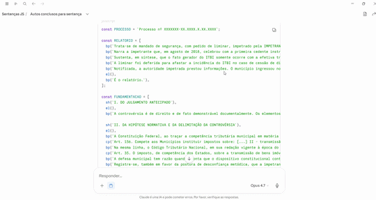

**[Leia em Português 🇧🇷](README.pt-BR.md)**

# Court Ruling Generator — .docx



A desktop application (Electron) that converts structured court rulings written in JavaScript format into Word documents (.docx) formatted according to Brazilian legal standards.

## Why JavaScript as an intermediate format?

Reasonable question: why generate rulings in JS and then convert, instead of asking an LLM to produce the `.docx` directly?

**Answer: significant token savings in LLM sessions.**

Asking a model to generate a formatted `.docx` forces it to produce (directly or indirectly) the entire OpenXML structure — paragraph tags, run properties, font formatting, spacing, indentation — repeated for every block. This burns tokens fast.

The JS format used in this project reduces the model's output to the essentials:

```js
bp('This is a writ of mandamus filed by...')
cp('Art. 156. Municipalities are responsible for...')
sh('I. EARLY JUDGMENT')
el()
```

Formatting (Times 12, 2.5cm indent, italic citations, 1.5 line spacing, etc.) is encoded **once** inside this app — it doesn't need to be repeated by the model for every paragraph.

> **Author's note:** in my own Claude Pro sessions, I observed that asking for direct `.docx` generation consumes roughly **7% more session capacity** compared to generating the same content in JS format and converting it with this app. The metric is empirical and based on personal usage, but the difference has been consistent across multiple sessions. In workflows with several rulings per session, this saved context can be spent on what matters: the legal reasoning.

## Expected format

The text pasted into the window must follow this structure:

```js
const PROCESSO = 'Case No. 0000000-00.0000.0.00.0000';

const RELATORIO = [
  bp('This is a lawsuit filed by John Doe against Jane Roe...'),
  bp('The plaintiff alleges that...'),
  el(),
  bp('This is the report.'),
];

const FUNDAMENTACAO = [
  sh('I. EARLY JUDGMENT'),
  el(),
  bp('The controversy is legal and factually demonstrable through documents...'),
  sh('II. MERITS'),
  el(),
  bp('The Federal Constitution provides:'),
  cp('Art. 5, LIV - no one shall be deprived of liberty or property without due process of law.'),
  bp('In the present case...'),
];

const DISPOSITIVO = [
  bp('For the reasons stated above, the Court GRANTS the request...'),
];
```

Each function marks a paragraph type:

| Function | Type | Formatting in the .docx |
|----------|------|-------------------------|
| `bp(text)` | regular paragraph | Times New Roman 12, justified, first-line indent 2.5cm, 1.5 line spacing |
| `sh(text)` | subheading | Times New Roman 12, **bold**, justified |
| `cp(text)` | legal/doctrinal citation | Times New Roman 12, *italic*, justified, left indent 2.5cm |
| `el()` | blank line | empty paragraph |

The sections `RELATORIO` (Report), `FUNDAMENTACAO` (Reasoning), and `DISPOSITIVO` (Ruling) are rendered as centered bold headings inside the document.

## Installation

Requires [Node.js](https://nodejs.org/) installed.

In the project folder, via PowerShell or CMD:

```
npm install
```

## Development mode

```
npm start
```

The window opens, paste the text into the main field, click **Gerar .docx** (Generate .docx), and choose where to save.

## Building a Windows executable (.exe)

For a standalone `.exe` (no need to open a terminal each time):

```
npm install --save-dev electron-builder
npm run build
```

The portable executable is generated in `dist\`.

## Project structure

```
sentenca-docx/
├── package.json
├── README.md
├── .gitignore
└── src/
    ├── main.js       # Electron main process (window, IPC, file saving)
    ├── preload.js    # secure bridge between UI and backend
    ├── index.html    # graphical interface
    ├── parser.js     # executes the pasted JS in a secure sandbox (vm)
    └── gerador.js    # assembles the .docx using the `docx` library
```

## How it works under the hood

The parser **executes the pasted JS code** inside an isolated sandbox (Node's `vm` module), with the functions `bp`, `sh`, `cp`, `el` redefined to tag each paragraph with its type. No fragile regex trying to interpret text — the user's own JS is interpreted by Node, safely. The generator then applies the correct formatting for each identified type.

This means adding new helper functions (e.g., a `ct()` for topic conclusions) is just a matter of adding the corresponding line in `parser.js` and the style in `gerador.js`.

## License

MIT
